# Vibe Check reviewer showcase

> **Status:** Vibe Check 0.4.0 Beta 1; not a signed public release yet  
> **Screenshots shown:** pre-rename `0.3.0` UI at commit `762b96b`; the visible screens remain representative of Vibe Check 0.4.0 Beta 1  
> **Showcase source:** commit `762b96b3e59cd51f1567c0b1482b2a1826e20aee`  
> **Debug APK SHA-256:** `603954816717f5c60304edcd04c0f5ab337b3a7e8b8a2b1edf2ab4e71605a61d`

Vibe Check is a local-first native Android training log for people who want one coherent place for strength work, stretching, skill progressions, habits, body measurements and historical context. It records objective history first, then derives explainable views from those records. The muscle map deliberately shows **freshness derived from training recency**, not a speculative claim about fatigue or recovery.

What distinguishes the app is the connection between detailed workout logging and legible daily feedback: variation-specific set inputs feed stable history, progress scoring, personal records, activity heatmaps and reconstructable historical body maps. Draft workouts remain editable and recoverable without contaminating any derived view.

## Visual tour

All images below come from the exact debug APK identified above, installed on an API 35 emulator using a 1080 × 2424 Pixel 9a-sized portrait display. The app was reset to controlled generated demo data before capture; the images contain no personal information.

### Home: freshness and activity

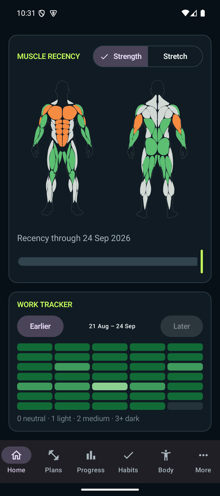

The Home screen keeps the current strength/stretch context visible, colours the anatomy by the last qualifying finished session, and reconstructs earlier states with the date slider. The activity grid combines finished training and completed habit activity without presenting either as recovery science.

### Programmes and a coherent editor

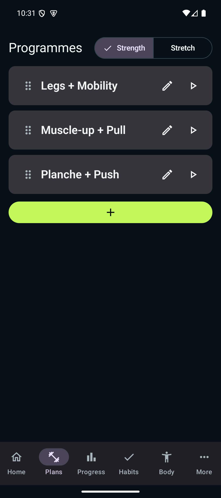

Programmes are reusable templates rather than a forced calendar. A user can start any day whenever it fits, switch between strength and stretching, reorder plans, edit them, or launch directly.

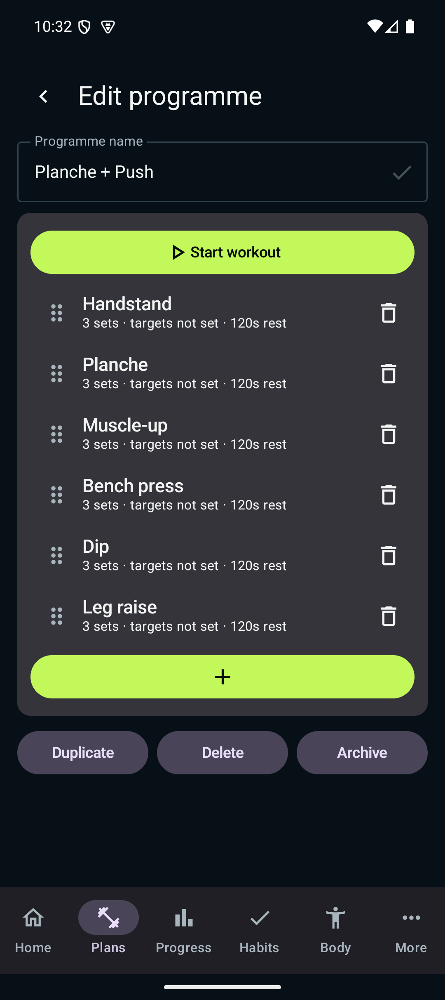

The editor keeps the workout sequence together. Exercises can be added, removed and reordered; programme targets and rest settings are edited in context. Duplicate, delete and archive are explicit separate actions.

### Active workout logging

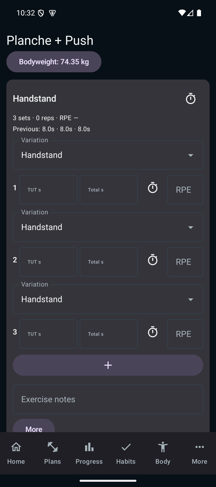

Logging is optimized for use between sets. Each row exposes only the fields enabled for that exercise variation. Wall and freestanding handstands, assisted/bodyweight/weighted pull-ups, bands, added load, holds, Total Time, RPE and other set types can therefore share one compact workflow without sharing the wrong configuration. Stopwatch apply updates the same durable set row rather than creating a duplicate.

Set drafts autosave. If Android recreates the process, unfinished input returns; submitted sets are not duplicated. Nothing from a draft workout affects Home, Progress, History or PRs until **Finish workout**.

### Progress

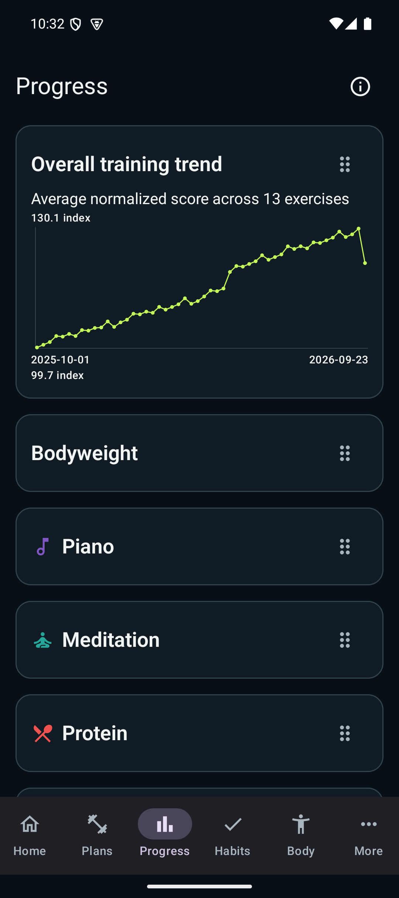

Progress starts collapsed for scanability. The overall trend normalizes valid exercise histories; exercise detail exposes rolling performance, variation filters, RPE context and PRs. Weighted reps, holds, assistance and ordered skills use different scoring rules instead of being flattened into one generic number. Bodyweight uses the same underlying records as the Body screen.

### Habits

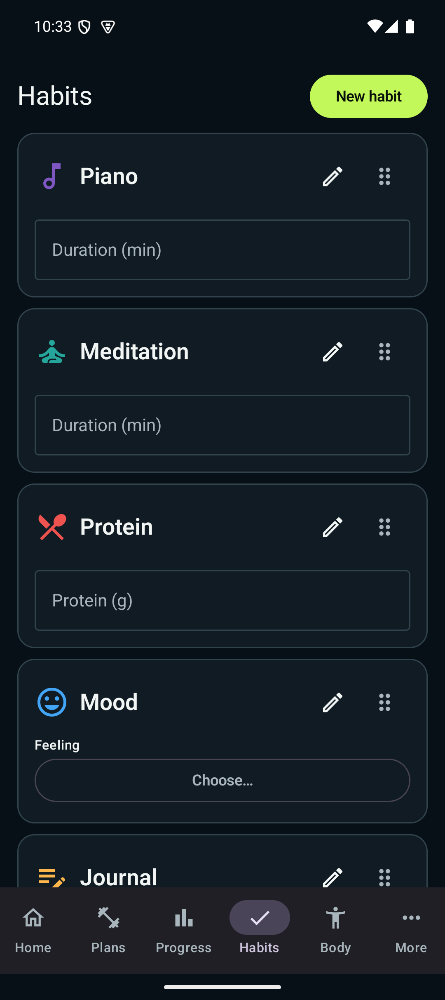

Habits are open-ended trackers, not streak obligations. A day can contain Boolean, numeric-with-unit, duration, text, choice, rating or date/time data. Optional targets contribute at most one activity to the Home heatmap; there are no schedules or missed-day penalties.

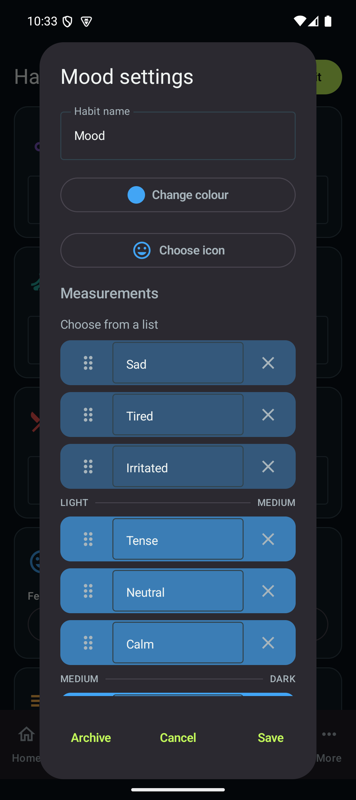

Choice-based habits keep their values and heatmap shade mapping together in one visual editor. Values can be added, removed and reordered, and the boundaries between light, medium and dark are visible without a separate configuration maze.

### Fixed navigation, More and Archive

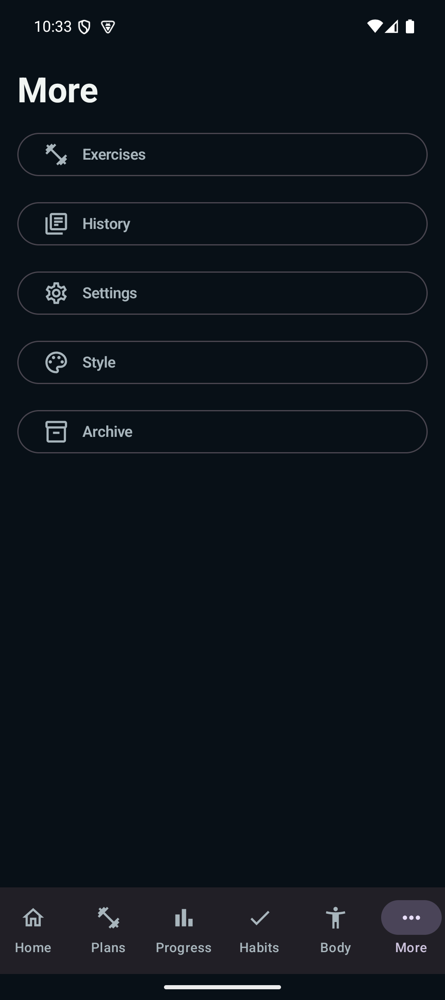

The six fixed destinations cover everyday work: Home, Plans, Progress, Habits, Body and More. Less-frequent catalogue, history, data/style and archive tools remain one tap away. Archive provides a single place to restore archived plans, custom exercises and habits.

### Exercise catalogue

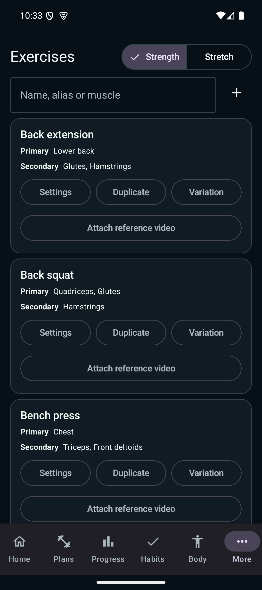

The maintained catalogue is searchable by canonical name, alias or muscle and separates strength from stretching. Primary and secondary muscle roles are visible on each card. Seeded exercises can be duplicated for customization; exercise variations have independent tracking fields, targets, RPE and rest settings while remaining grouped under their parent. A few useful reference videos can be copied from the Android document picker into app-private storage, played in-app and explicitly deleted.

### History and correction

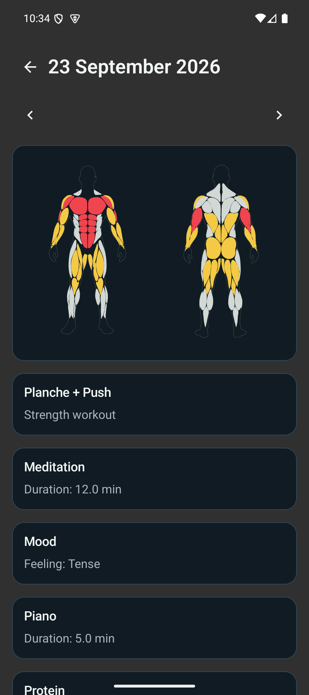

Every finished day can be reconstructed from records rather than stored screenshots. History supports searching workouts and notes, correcting workout dates and recorded sets, and opening the derived map for that day. Corrections flow back through progress and historical views.

### Bodyweight and photos

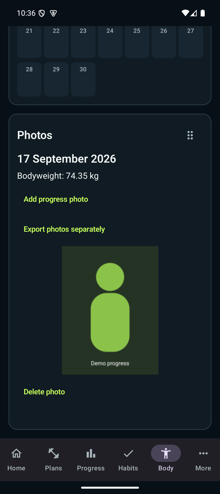

Bodyweight is available as a trend and a calendar so a value is easy to find in time. Selecting a day reveals its measurement and progress photo. Imported photos are copied into private app storage, remain after a normal same-app update, and can be exported separately or deleted explicitly.

### Settings, data and style entry

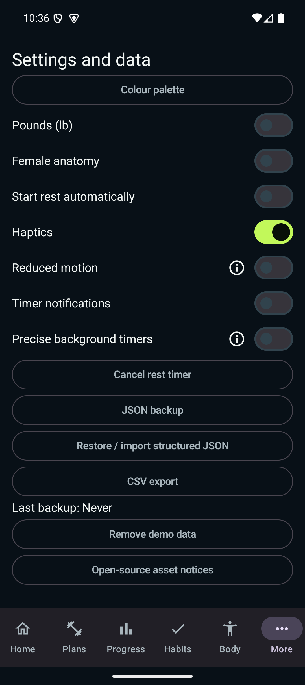

Settings use switches for binary preferences and direct actions for operations. Colour palettes and custom semantic colours live behind **Colour palette**. JSON backup/import, CSV export, timer permission routes, demo-data removal and open-source notices are deliberately visible rather than hidden in platform menus.

## Feature overview

### Programmes, workouts and sets

- Create, edit, duplicate, reorder, archive and restore strength programmes and stretching routines.
- Start any programme day on demand; there is no schedule requirement.
- Configure each exercise variation independently while preserving its parent grouping.
- Log weight and reps, bodyweight, added weight, assistance, stacked bands, holds, Total Time, RPE, left/right values, range of motion, warm-ups and failed/partial attempts.
- Use editable count-up timers for time fields and manual or automatic background rest timers.
- Substitute an exercise for one workout without merging unlike histories.
- Retain previous performance, exercise notes, variation snapshots, supersets and circuit-level rest behavior.
- Recover the active workout and unfinished set input after interruption or process recreation.
- Keep drafts out of freshness, progress, PR and history calculations until finish.

### Derived training views

- Separate strength and stretching freshness maps with male/female anatomy profiles.
- Primary and secondary muscle dose expressed as explainable set-equivalents.
- Historical map reconstruction for any recorded day.
- Five-week activity heatmap combining completed training and qualifying habit activity.
- Exercise-specific performance scoring, rolling trends and personal records.
- Variation-aware assisted and skill comparisons so unlike performances are not ranked together.

### Habits, history and body data

- Flexible multi-field habits with units, targets, icons, colours and choice shade ordering.
- One editable value per field per day without streak pressure.
- Searchable workout history with date/set correction and day-level activity context.
- Bodyweight entry, line trend and calendar backed by the same measurement records.
- App-private progress photos associated with bodyweight days and exported separately.

### Personalization and platform behavior

- kg/lb preference, selectable anatomy, multiple built-in palettes and custom semantic colours.
- Reduced motion removes app-owned transition animation and touch ripples.
- Notification and precise-alarm settings are linked for background rest timers.
- Content descriptions, scalable Compose layouts and consistent controls support accessibility review.
- A haptics preference is stored, but comprehensive haptic behavior is **not yet established**; see limitations.

## Data, storage and privacy

Vibe Check has no account, advertising SDK, cloud database or cloud sync. Personal records live on-device in a Room database. Progress photos and exercise reference videos are copied into the app's private files directory.

The database, photos and copied videos survive app restart, process recreation and a normal update installed over the same application ID with the same signing identity. The 0.4.0 rename changes that identity to `com.petermathie.vibecheck`, so Vibe Trainer app-private data does not transfer automatically; structured JSON remains import-compatible. Uninstalling the app or clearing its data removes app-private records.

Structured JSON backup/import covers the Room records and relevant preferences with strict validation. CSV export provides inspectable structured training data. Progress photos are intentionally excluded from JSON and exported as a separate ZIP. Exercise reference videos are currently app-private only and are not part of either JSON or photo export.

Debug builds contain generated representative personal data. **Remove demo data** deletes those workouts, programmes, habits, body measurements and generated photos while retaining the maintained exercise catalogue and preserving non-demo records.

See [Import format](IMPORT_FORMAT.md) for the structured contract and [Product requirements](PRODUCT_REQUIREMENTS.md) for calculation and product truth.

## Architecture and quality

The app is a native Kotlin application using Jetpack Compose, Room and Hilt. Room schema 12 stores the catalogue, programmes, workout drafts and snapshots, finished history, habits and body measurements. Explicit migrations and checked-in schemas protect upgrades. Derived screens read the same underlying records instead of maintaining independent copies of progress state.

The validation suite covers migrations, strict backup/import, seed integrity, workout recovery and duplicate prevention, set and band workflows, history recalculation, progress scoring, demo cleanup, photos, reference videos and Compose interaction/accessibility regressions. At the showcase source, `gradle testDebugUnitTest assembleDebug connectedDebugAndroidTest --no-daemon` passed with all **67 API 35 instrumentation tests**. The APK was installed over ADB and every committed screenshot was visually inspected.

## Honest limitations and external gates

This is a beta and should be reviewed as one.

- **Real-phone QA:** locked-screen timer notifications, manufacturer battery restrictions and vibration behavior still require QA-01 on a physical phone. Do not infer complete haptic support from the current preference switch.
- **Old-database provenance:** DATA-01 requires an authentic version-1 database/schema fixture. The repository will not invent one to claim migration confidence.
- **Release operations:** persistent release signing, signed upgrade testing, store listing/data-safety work and final legal reconciliation remain external gates. There is no public release URL or in-app updater.
- **Cloud:** sync and multi-device accounts are intentionally deferred.
- **Habit analysis:** detailed per-metric habit charts are deferred; the current Progress surface prioritizes training and bodyweight trends.
- **Reference videos:** copied videos are not backed up and there is no enforced attachment-count cap.
- **Variation defaults:** initial workout row count and header rest action use the first-ranked variation until a row variation is selected.

Release gates are tracked in [Release readiness](RELEASE.md), and hands-on beta journeys are in [Beta testing](BETA_TESTING.md).
Deferred personality, weekly habit and platform-extension concepts are collected separately in [Future ideas](FUTURE_IDEAS.md); they are exploratory rather than current requirements.

## Reviewer guide

The most valuable feedback is about whether the app communicates its model clearly while staying fast enough for use during training.

### Product and workflow

1. Start a programme, log one set, leave the app, return, then finish the workout.
2. Confirm the draft is absent from Home/Progress before finish and present afterward.
3. Switch a handstand or pull-up variation and decide whether the visible inputs match the movement.
4. Substitute an exercise and check that its history remains separate.
5. Ask whether archive/restore and destructive actions are discoverable and appropriately separated.

### UX, accessibility and visual polish

1. Use the six fixed navigation destinations one-handed.
2. Increase Android font/display size and inspect compact workout rows and dialogs.
3. Enable reduced motion and check that the app remains understandable without transition cues.
4. Review contrast, focus order, icon meaning, empty states and touch-target spacing across palettes.
5. Identify any explanation that is missing, or any explanation the interface no longer needs.

### Correctness and data safety

1. Export JSON, change a record, then import the backup and verify the result.
2. Correct an old set/date and confirm History, Progress and the historical map agree.
3. Attach a progress photo and exercise reference video, restart/update the app, then verify persistence.
4. Remove demo data and confirm that the exercise catalogue and custom/personal records remain.
5. Probe zero/failed attempts, missing RPE, band stacks and variation changes for misleading PRs.

## Installation and reproducibility

There is no signed public build. Reviewers can use the debug artifact described in [Beta testing](BETA_TESTING.md), or build the current source with JDK 17 and Android SDK 36:

```sh
gradle :app:testDebugUnitTest :app:assembleDebug
adb install -r app/build/outputs/apk/debug/app-debug.apk
```

Use `adb install -r` only when the existing installation has a compatible signing identity. Make a JSON backup and separate photo export before replacing important test data. Debug builds intentionally seed removable sample data.

For full local validation with an API 35+ emulator:

```sh
gradle testDebugUnitTest assembleDebug connectedDebugAndroidTest --no-daemon
```

## Related documents

- [Product requirements](PRODUCT_REQUIREMENTS.md)
- [Beta testing journeys](BETA_TESTING.md)
- [Structured import format](IMPORT_FORMAT.md)
- [Release readiness and external gates](RELEASE.md)
- [Third-party notices](../THIRD_PARTY_NOTICES.md)
